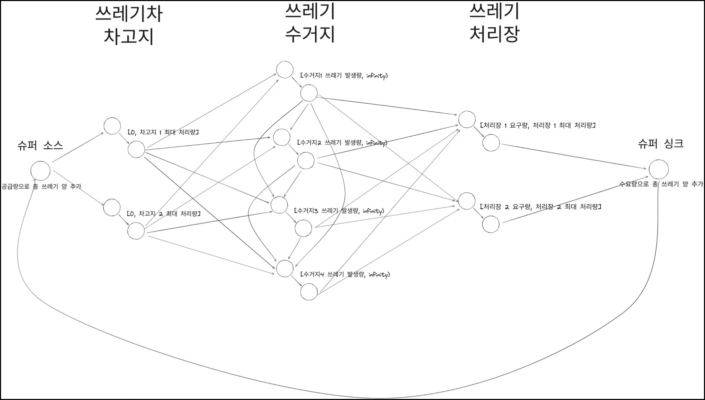
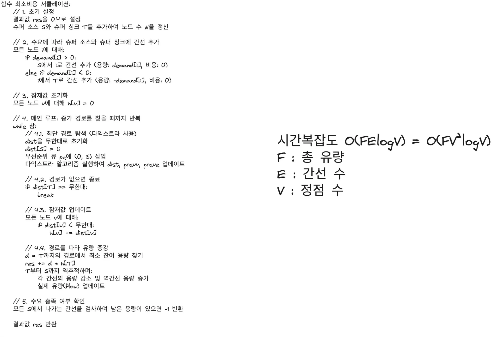
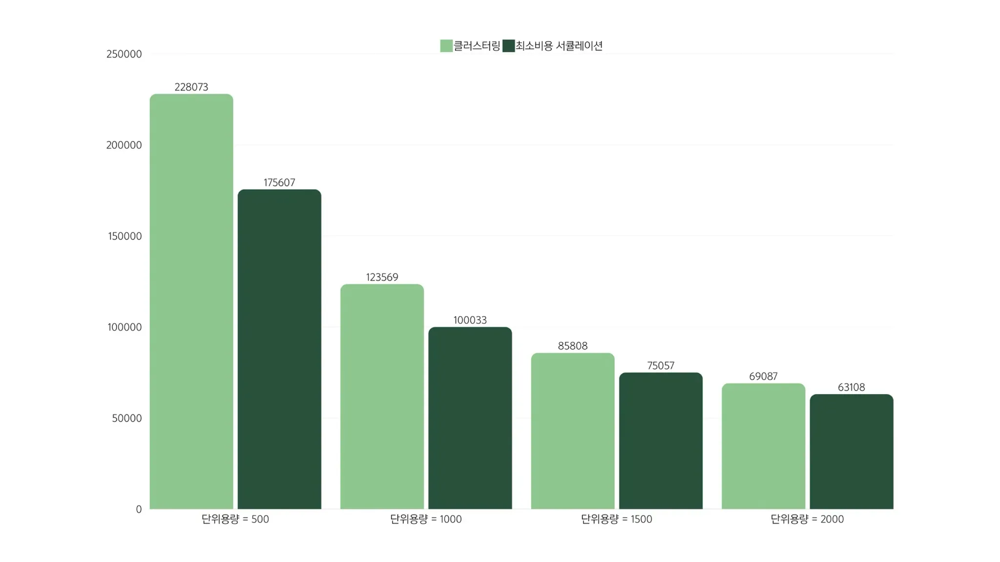

# **프로젝트 소개**

---
서울시 서대문구의 쓰레기 발생 데이터를 분석하여, 기존 수거 방식의 비효율성을 개선하고 비용 절감 및 환경 부담 완화를 목표로 진행한 프로젝트입니다. 데이터 기반 예측 모델과 최적화 알고리즘을 결합하여, 실제 운영에 적용 가능한 쓰레기 수거 경로를 도출하는 데 중점을 두었습니다.

# 프로젝트 내용

---
- **데이터 기반 모델 구축 (팀원의 파트)**
    - 서울시의 쓰레기 발생량, 인구 분포, 인구 밀도, 연령대별 인구수 등 다양한 자료를 활용하여 각 지역의 쓰레기 발생 특성을 분석하였습니다.
    - 회귀분석 기법을 적용하여 인구당 쓰레기 발생량을 산출하는 통계식을 도출하였습니다. 도출된 식은 다음과 같습니다:
        - *Trash = -0.0096 × 인구밀도 + 0.0011 × 인구수 - 0.0069 × (65세 이상 인구수) + 456.48*
    - 이 모델을 통해 각 지역별 예상 쓰레기 양을 정량적으로 산출할 수 있었습니다.
- **지리적 분할 및 할당:**
    - 서대문구 내 각 동의 인구 정보를 바탕으로, 각 동의 단위 면적당 쓰레기 발생량이 동일하다는 가정을 설정하고, 이를 통해 동별 쓰레기 총 발생량을 산출하였습니다.
    - 쓰레기통(수거 지점)의 위치 정보를 활용해 **보로노이 다이어그램**을 생성하였습니다. 보로노이 다이어그램 기법을 통해 각 쓰레기통에 할당되는 예상 쓰레기 발생량을 계산하였습니다.
- **네트워크 모델링 및 최적화:**
    - 쓰레기 수거 경로 문제를 네트워크 플로우 문제로 환원하였습니다. 차고지에서 일정량의 유량(쓰레기 처리 능력)이 공급되고, 소각장에서 해당 유량이 소멸하는 구조로 모델링하였으며, 각 쓰레기 발생 지점에서는 유량의 하한이 존재하도록 제약을 부여하였습니다.
    - 네트워크 상의 각 정점를 분할하여 최소 및 최대 유량 제약을 설정하였습니다.
    - 최소비용 최대 유량 문제를 서큘레이션 문제로 접근하여, 최소비용 서큘레이션 알고리즘을 적용하였습니다. 이를 통해 전체 수거 경로의 운행 비용을 최소화하는 최적 경로를 산출하였으며, 기존의 단순 클러스터링 방식과 비교하여 알고리즘의 안정성과 효율성을 검증할 수 있었습니다.

## 발생문제 및 해결방법

---
- 해당 모델링에서는 쓰레기 양과 이동 시간에 비례해서 비용이 책정되는데, 실제로는 차량 대수에 비례하게 이산적으로 책정됩니다. 이로 인해 이론적으로 도출된 최적 경로와 실제 운영 간에는 차이가 발생할 수 있습니다.
- 최적화 결과는 이론적인 최적 흐름을 제시할 뿐, 실제 차량 매칭 및 스케줄링 문제는 반영하지 않았습니다. 따라서 향후 실제 운영 환경에 적용하기 위해 차량 스케쥴링과의 연계가 필요하다는 점을 확인하였습니다.

## 프로젝트 사진
---

자세한 내용은 발표 PDF파일 확인 부탁드립니다!